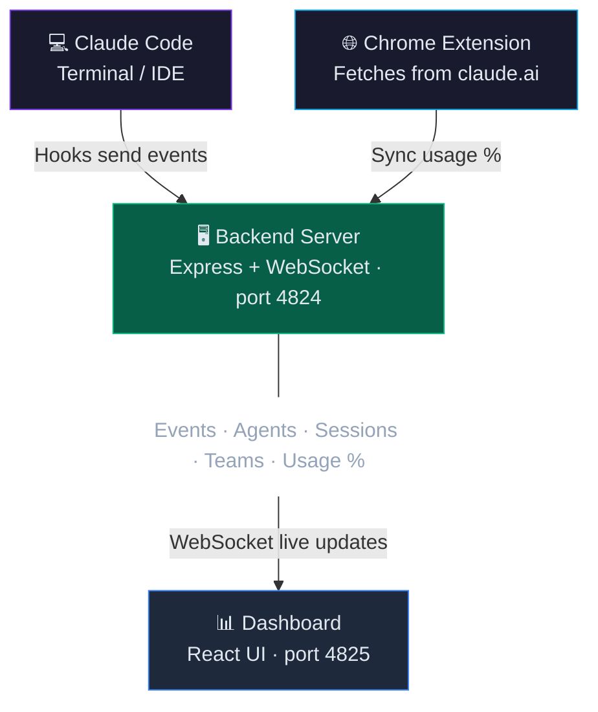

# Oh My Claude

> Real-time monitoring dashboard for Claude Code — track tokens, agents, teams, costs, and activity live.
>
> **🇹🇭 [อ่านภาษาไทย](README_TH.md)**


---

## 💡 Why I Built This

### 🔥 Token Burnout — the real pain

- Used Claude Code in flow state, shipped feature after feature... then **BAM — rate limit hit**
- 5-hour session gone. Didn't even see it coming
- Needed a way to see usage **while working**, not after it's too late

**Solution → Token Usage panel with live countdown:**

| | Session | Weekly |
|---|---------|--------|
| **Resets in** | 1h 18m | 5d 23h |
| **Usage** | 60% | 19% |

- Status badge warns you: 🪴 Normal → ⚡ High → 🚨 Near limit → 🫗 Full
- Now I actually pace myself instead of rage-waiting 5 hours

### 🤖 "What are my agents doing?"

- Opus 4.6 spawns team agents — code-reviewer, worker, reviewer-2 — but **what are they actually doing?**
- Wanted to see: who's active, what tool they're using, how many tokens each one burns
- **Team Comms** — they literally talk to each other (broadcasts, DMs, task assignments). Fun to watch
- **Subagents** — watch them spawn, do work, and die. Circle of AI life
- The session % with team agents? Drains *hilariously* fast. Like watching your phone battery on a video call

Started as "how much quota left?" → became a window into how Claude Code works under the hood

---

## ✨ Features

| Feature | Description |
|---------|-------------|
| **Token Tracking** | Session (5h) & Weekly usage with countdown timers and per-model breakdown |
| **Agent Monitoring** | Live main agents + subagents tree with status, tokens, and current tool |
| **Team Monitoring** | Track team agents with independent token growth and member health |
| **Team Comms** | Inter-agent messages (broadcasts, DMs) displayed in real-time |
| **Activity Feed** | Tool calls, prompts, errors streamed live with filterable event types |
| **Cost Estimation** | Monthly cost by model (Opus / Sonnet / Haiku) |
| **Last 12 Hours** | Hourly token usage bar chart with model breakdown |
| **Event Details** | Click any event to inspect Input/Output in footer detail panel |
| **Mini Pop-out** | Floating mini window (280x400px) for compact monitoring |
| **Install as App** | PWA support — install to desktop, runs without browser UI |
| **Dark / Light Theme** | Comprehensive theme system with semantic color tokens — fully readable in both modes |
| **Notifications** | Desktop notifications for events (bell toggle) |
| **Bilingual Guide** | Built-in help guide in English & Thai (11 sections) |
| **Chrome Extension** | Sync usage % directly from Claude.ai — **strongly recommended** |
| **Demo Mode** | Replay 1,006 real events with retro tape counter UI |

### Usage Status Indicator

| Icon | Status | Range |
|------|--------|-------|
| 🪴 | Normal | < 60% |
| ⚡ | High | 60–84% |
| 🚨 | Near limit | 85–99% |
| 🫗 | Full | 100% |

---

## 🚀 Quick Start

### Prerequisites

| Requirement | Version | Check |
|-------------|---------|-------|
| **Node.js** | 18+ | `node --version` |
| **npm** | 9+ | `npm --version` |
| **Claude Code** | Latest | `claude --version` |

### Step 1: Clone & Install

```bash
git clone https://github.com/suparerk9x/Oh-My-Claude.git
cd Oh-My-Claude
npm run install:all
```

### Step 2: Configure Claude Code Hooks

> **Required** — without hooks, the dashboard won't receive any events.

Edit your Claude settings file:

| OS | Path |
|----|------|
| Windows | `C:\Users\<username>\.claude\settings.json` |
| macOS / Linux | `~/.claude/settings.json` |

Add the `hooks` section — replace `<PATH>` with your Oh-My-Claude folder path:

<details>
<summary>📋 Click to expand hooks JSON config</summary>

```json
{
  "hooks": {
    "PreToolUse": [
      {
        "matcher": "",
        "hooks": [
          {
            "type": "command",
            "command": "node \"<PATH>/Oh-My-Claude/hooks/send_event.js\" --event-type PreToolUse"
          }
        ]
      }
    ],
    "PostToolUse": [
      {
        "matcher": "",
        "hooks": [
          {
            "type": "command",
            "command": "node \"<PATH>/Oh-My-Claude/hooks/send_event.js\" --event-type PostToolUse"
          }
        ]
      }
    ],
    "SubagentStart": [
      {
        "hooks": [
          {
            "type": "command",
            "command": "node \"<PATH>/Oh-My-Claude/hooks/send_event.js\" --event-type SubagentStart"
          }
        ]
      }
    ],
    "SubagentStop": [
      {
        "hooks": [
          {
            "type": "command",
            "command": "node \"<PATH>/Oh-My-Claude/hooks/send_event.js\" --event-type SubagentStop"
          }
        ]
      }
    ],
    "UserPromptSubmit": [
      {
        "hooks": [
          {
            "type": "command",
            "command": "node \"<PATH>/Oh-My-Claude/hooks/send_event.js\" --event-type UserPromptSubmit"
          }
        ]
      }
    ],
    "Stop": [
      {
        "hooks": [
          {
            "type": "command",
            "command": "node \"<PATH>/Oh-My-Claude/hooks/send_event.js\" --event-type Stop"
          }
        ]
      }
    ],
    "PreCompact": [
      {
        "hooks": [
          {
            "type": "command",
            "command": "node \"<PATH>/Oh-My-Claude/hooks/send_event.js\" --event-type PreCompact"
          }
        ]
      }
    ],
    "Notification": [
      {
        "hooks": [
          {
            "type": "command",
            "command": "node \"<PATH>/Oh-My-Claude/hooks/send_event.js\" --event-type Notification"
          }
        ]
      }
    ],
    "PermissionRequest": [
      {
        "hooks": [
          {
            "type": "command",
            "command": "node \"<PATH>/Oh-My-Claude/hooks/send_event.js\" --event-type PermissionRequest"
          }
        ]
      }
    ],
    "SessionStart": [
      {
        "hooks": [
          {
            "type": "command",
            "command": "node \"<PATH>/Oh-My-Claude/hooks/send_event.js\" --event-type SessionStart"
          }
        ]
      }
    ],
    "SessionEnd": [
      {
        "hooks": [
          {
            "type": "command",
            "command": "node \"<PATH>/Oh-My-Claude/hooks/send_event.js\" --event-type SessionEnd"
          }
        ]
      }
    ],
    "TeammateIdle": [
      {
        "hooks": [
          {
            "type": "command",
            "command": "node \"<PATH>/Oh-My-Claude/hooks/send_event.js\" --event-type TeammateIdle"
          }
        ]
      }
    ],
    "TaskCompleted": [
      {
        "hooks": [
          {
            "type": "command",
            "command": "node \"<PATH>/Oh-My-Claude/hooks/send_event.js\" --event-type TaskCompleted"
          }
        ]
      }
    ]
  }
}
```

</details>

**Path examples** (use forward slashes `/` even on Windows):

| OS | Example |
|----|---------|
| Windows | `node "D:/Projects/Oh-My-Claude/hooks/send_event.js" --event-type PreToolUse` |
| macOS | `node "/Users/john/Oh-My-Claude/hooks/send_event.js" --event-type PreToolUse` |

### Step 3: Install Chrome Extension

> **Strongly recommended** — this is how the Token Usage panel gets session/weekly % and countdown timers. See [Chrome Extension](#-chrome-extension-strongly-recommended) section for details.

### Step 4: Start

**Windows:**

```bash
start.bat
```

**Any OS:**

```bash
npm run dev
```

This starts both backend (port 4824) and frontend (port 4825).

### Step 5: Open Dashboard

Open **http://localhost:4825** — you should see:

- Header shows **LIVE** (green dot)
- Backend status shows **OK**

---

## 🏗️ System Architecture



**Data Flow:**

1. **Claude Code** → Hooks fire events (PreToolUse, PostToolUse, SessionStart, SessionEnd, etc.) → Backend
2. **Chrome Extension** → Fetches usage % from claude.ai → Backend (every 1 min)
3. **Backend** → Aggregates all data → Broadcasts via WebSocket
4. **Dashboard** → Receives via WebSocket → Renders in real-time

---

## 🌐 Chrome Extension (Strongly Recommended)

> **This is how the Token Usage panel gets its data.** Without the extension, you won't see session/weekly usage percentages or countdown timers — the core feature that prevents token burnout.

Syncs your Claude.ai usage percentage to the dashboard every minute, automatically.

### Install

1. Open `chrome://extensions/`
2. Enable **Developer mode** (top right)
3. Click **Load unpacked** → select the `extension/` folder
4. Open [claude.ai](https://claude.ai) once to login (extension grabs your session)

### How it works

```
Claude.ai → Extension (fetches API every 1 min) → Backend :4824 → Dashboard
```

1. Extension detects your organization and starts syncing
2. Dashboard header shows **Sync** badge with fun status messages
3. Token Usage panel updates with live session % and countdown timers

> **Note:** First login to claude.ai is required so the extension can grab your session cookie. After that, sync works in the background — no need to keep the tab open.

---

## 💻 Install as Desktop App (PWA)

Oh My Claude supports **Progressive Web App** — you can install it as a standalone desktop app:

1. Open **http://localhost:4825** in Chrome
2. Click the **Install app** icon (monitor with ↓ arrow) in the address bar
3. Click **"Install"** in the popup dialog
4. App opens in its own window — pin to taskbar!

**Benefits:**
- Runs in a clean window without browser tabs or address bar
- Can be pinned to taskbar / dock for quick access
- Works just like a native desktop app

> **Note:** The backend server (`npm run dev`) must be running for the app to work.

---

## 🪟 Mini Pop-out Window

A compact floating window for monitoring while you work:

- Click the **Mini Pop-out** button (↗) in the header toolbar
- Opens a **280x400px** floating window
- Shows: connection status, token gauges, agent list with team members, and smart status
- Syncs theme (dark/light) and demo mode bidirectionally with the main app
- Perfect for keeping on the side while coding

---

## 🎬 Demo Mode

Try the full dashboard without a live Claude Code session. Demo Mode replays 1,006 real captured events with simulated data.

### How to Enable

1. Open the **Dashboard Guide** (? button in toolbar)
2. Click the **Demo** button in the guide header
3. Header changes from **LIVE** to **DEMO** with amber glow

### Playback Controls

A retro-styled tape counter and control buttons appear next to the DEMO badge:

| Control | Description |
|---------|-------------|
| **Counter** | Digital LED counter (Share Tech Mono font) showing current event number. Digits spin up with animation. |
| **Play / Pause** | Start replaying events. Click again to pause — counter freezes and state is preserved. |
| **Reset** | Stop playback and clear all state. Counter returns to 0000, all panels reset. |

### Playback States

| State | Description |
|-------|-------------|
| **Idle** | Initial state — counter shows 0000, dashboard empty |
| **Playing** | Events replay at variable speed based on event type |
| **Paused** | Frozen in place — all data visible, counter stopped |
| **Finished** | All 1,006 events played — dashboard shows final state |

### Event Timing

| Event Type | Delay | Note |
|------------|-------|------|
| `UserPromptSubmit` | 600ms | User messages — longest pause |
| `SubagentStart/Stop` | 400ms | Agent lifecycle events |
| `SendMessage/TeamCreate` | 250ms | Team operations |
| `PreToolUse/PostToolUse` | 80ms | Tool calls — fastest |

### What Gets Simulated

- **Token Usage** — Session 30%, Weekly 17%, with countdown timers and Last 12 Hours chart
- **Agents Panel** — Main sessions spawn, subagents appear with real tool activity
- **Team Agents** — 3 team members (code-reviewer, worker, reviewer-2) with independent token growth
- **Team Comms** — 8 inter-agent messages flow between team members during replay
- **Activity Feed** — Read, Write, Edit, Bash, Grep, Glob, TodoWrite events stream in real-time
- **Event Details** — Click any event to see Input/Output in the footer detail panel
- **Footer Stats** — Event counts, monthly cost ($7,867), per-model breakdown
- **Status Badge** — Header shows usage status with session percentage

### Demo Data Source

Events are captured from a real Claude Code session using `scripts/prepare-demo-data.js`. The script converts `backend/events.json` into a trimmed, reproducible dataset at `frontend/src/data/demoData.js`.

---

## 📁 Project Structure

```
Oh-My-Claude/
├── package.json              # Root scripts (npm run dev, install:all)
├── start.bat                 # Windows quick start
├── create-shortcut.bat       # Create desktop shortcut (Windows)
├── README.md                 # Documentation (EN)
├── README_TH.md              # Documentation (TH)
│
├── backend/
│   ├── server.js             # Express + WebSocket server (port 4824)
│   ├── statsReader.js        # Read transcript files for token stats
│   ├── events.json           # Event history (auto-created)
│   ├── agents.json           # Agent state (auto-created)
│   └── __tests__/            # Jest tests
│
├── frontend/
│   ├── index.html            # Main dashboard entry
│   ├── mini.html             # Mini pop-out entry
│   ├── vite.config.js        # Vite config (port 4825, proxy)
│   ├── tailwind.config.js    # Tailwind CSS config
│   ├── postcss.config.js     # PostCSS config
│   ├── public/
│   │   ├── favicon.svg       # App icon
│   │   ├── manifest.json     # PWA manifest
│   │   └── sw.js             # Service worker for PWA
│   └── src/
│       ├── App.jsx           # Main dashboard
│       ├── MiniApp.jsx       # Mini pop-out window
│       ├── main.jsx          # Main entry + PWA registration
│       ├── mini-main.jsx     # Mini entry + PWA registration
│       ├── index.css          # Global styles (Tailwind imports)
│       ├── config/
│       │   ├── theme.js      # Theme system (11 color categories: status, model, tool, event, semantic, etc.)
│       │   └── eventTypes.js # Event type definitions (theme-aware colors)
│       ├── data/
│       │   └── demoData.js   # Demo replay dataset (1,006 events)
│       ├── hooks/
│       │   ├── useDemoReplay.js     # Demo replay state machine
│       │   ├── useNotifications.js  # Desktop notifications
│       │   └── usePolling.js        # API polling hook
│       ├── utils/
│       │   └── format.js     # Token/number formatting
│       └── components/
│           ├── AgentTree.jsx       # Agent hierarchy tree
│           ├── AgentCard.jsx       # Single agent display
│           ├── ActivityItem.jsx    # Event list item
│           ├── TokenGauge.jsx      # Circular usage gauge
│           ├── TokenStats.jsx      # Model breakdown stats
│           ├── HourlyBreakdown.jsx # Hourly usage chart
│           └── HelpGuide.jsx       # Help guide (EN/TH, 11 sections)
│
├── hooks/
│   └── send_event.js         # Hook script → sends events to backend
│
├── scripts/
│   └── prepare-demo-data.js  # Convert real events → demo dataset
│
├── extension/                # Chrome extension (strongly recommended)
│   ├── manifest.json         # Manifest V3
│   ├── background.js         # Background sync worker
│   ├── content.js            # Fetches usage from claude.ai
│   └── icons/                # Extension icons
│
└── docs/
    ├── AUDIT-REPORT.md       # Codebase audit report
    └── CODE_REVIEW.md        # Code review notes
```

---

## ⚙️ Configuration

### Ports

| Service | Port | File |
|---------|------|------|
| Backend | 4824 | `backend/server.js` |
| Frontend | 4825 | `frontend/vite.config.js` |

### Security

| Feature | Details |
|---------|---------|
| **CORS** | Restricted to localhost origins (4825, 5173) |
| **Rate Limiting** | General: 1,000 req/15min, Events: 300/min |
| **Input Validation** | Zod schema validation on all POST endpoints |
| **Path Traversal** | Sanitized file paths in statsReader |

### Agent Status Lifecycle

| Status | Timeout | Description |
|--------|---------|-------------|
| Active | — | Currently receiving events (green) |
| Idle | 3 min | No events for 3 min (yellow) |
| Stale | 8 min | No events for 8 min (orange) |
| Timeout | 20 min | No events for 20 min (gray) |
| Removed | 30 min | Cleaned up from agent list |

> **Note:** When an agent goes idle, its smart status automatically changes to "Stopped".
> If you close your IDE without a graceful exit, the timeout fallback handles cleanup.

### NPM Scripts

| Script | Description |
|--------|-------------|
| `npm run dev` | Start both backend + frontend |
| `npm run install:all` | Install all dependencies |
| `npm run build` | Build frontend for production |
| `npm run dev:backend` | Start backend only |
| `npm run dev:frontend` | Start frontend only |

---

## 🖥️ Dashboard Layout

```
┌─────────────────────────────────────────────────────┐
│  Header: LIVE · Sync · Toolbar · Clock · Status     │
├───────────┬──────────────┬──────────────────────────┤
│  Token    │   Agents     │   Activity Feed          │
│  Usage    │   Tree       │   (real-time events)     │
│  (200px)  │   (340px)    │   (flex)                 │
├───────────┴──────────────┴──────────────────────────┤
│  Event Detail Panel (expandable)                     │
├─────────────────────────────────────────────────────┤
│  Footer: Event Filters │ Monthly Cost │ Clock       │
└─────────────────────────────────────────────────────┘
```

### Header Toolbar

| Button | Description |
|--------|-------------|
| **View Mode** | Cycle: Full → Compact → Focus → Expanded → Hidden |
| **Theme** | Toggle Dark / Light |
| **Mini** | Open mini pop-out window |
| **Notifications** | Toggle: Off / Bell |
| **Guide** | Help guide with Demo toggle (11 sections, EN/TH) |
| **Status Badge** | Usage status (🪴⚡🚨🫗) |

### Agent Status

| Status | Color | Meaning |
|--------|-------|---------|
| Active | 🟢 Green | Currently receiving events |
| Idle | 🟡 Yellow | 3+ min no activity |
| Stale | 🟠 Orange | 8+ min no activity |
| Stopped | ⚪ Gray | Agent finished / stopped |
| Timeout | ⚪ Gray | 20+ min no activity |

### Model Icons

| Model | Icon | Color |
|-------|------|-------|
| Opus 4 | ◆ | Violet |
| Sonnet 4 | ● | Blue |
| Haiku 3.5 | ▪ | Green |

---

## ✅ Verify Installation

```bash
# Test 1: Backend health
curl http://localhost:4824/health
# → {"status":"ok"}

# Test 2: Send a message in Claude Code
# → Events should appear in Activity Feed

# Test 3: Check agents panel
# → Your session appears as "Main" agent with green status
```

---

## 🔧 Troubleshooting

| Problem | Solution |
|---------|----------|
| Dashboard shows **OFF** | 1. Check backend: `curl http://localhost:4824/health` <br> 2. Check browser console for WebSocket errors <br> 3. Hard refresh: `Ctrl+Shift+R` |
| No events appearing | 1. Verify hooks in `~/.claude/settings.json` <br> 2. Check path uses forward slashes `/` <br> 3. Restart Claude Code terminal |
| Extension not syncing | 1. Must be logged into claude.ai <br> 2. Check extension enabled at `chrome://extensions/` <br> 3. Check backend console for "Usage received" |
| PWA not installable | 1. Must access via `http://localhost:4825` (not IP) <br> 2. Use Chrome or Edge <br> 3. Check DevTools → Application → Manifest |
| Demo mode not working | 1. Open Guide → click Demo button <br> 2. Check browser console for errors <br> 3. Ensure `frontend/src/data/demoData.js` exists |

---

## 📡 API Reference

### REST

| Method | Endpoint | Description |
|--------|----------|-------------|
| GET | `/health` | Health check |
| GET | `/stats` | Token stats (cached) |
| GET | `/events` | Recent events |
| GET | `/agents` | Agent list with status |
| GET | `/sessions` | Session list |
| GET | `/teams` | Active teams |
| GET | `/teams/:name/comms` | Team communications |
| GET | `/teams/:name/files` | Team shared files |
| GET | `/usage` | Chrome extension usage data |
| POST | `/events` | Receive hook events (rate-limited: 300/min) |
| POST | `/usage` | Receive Chrome extension data |
| DELETE | `/events` | Clear all events |
| DELETE | `/agents` | Clear all agents |
| DELETE | `/agents/stopped` | Clear stopped agents only |

### WebSocket

Connect: `ws://localhost:4824`

| Message | Direction | Description |
|---------|-----------|-------------|
| `init` | Server → Client | Initial state (agents, events, stats, usage) |
| `event` | Server → Client | New event arrived |
| `stats` | Server → Client | Updated token stats |
| `agents_update` | Server → Client | Updated agent list |
| `usage` | Server → Client | Usage data from extension |
| `clear` | Server → Client | Events cleared |
| `agents_cleared` | Server → Client | Agents cleared |

---

## 🛠️ Tech Stack

| Layer | Technology |
|-------|------------|
| Backend | Node.js, Express, WebSocket (ws), Zod |
| Frontend | React 18, Vite, Tailwind CSS |
| PWA | Service Worker, Web App Manifest |
| Extension | Chrome Manifest V3 |

---

## 🤝 Contributing

1. Fork the repository
2. Create feature branch: `git checkout -b feature/amazing`
3. Commit changes: `git commit -m 'Add amazing feature'`
4. Push: `git push origin feature/amazing`
5. Open Pull Request

---

## 📄 License

MIT
