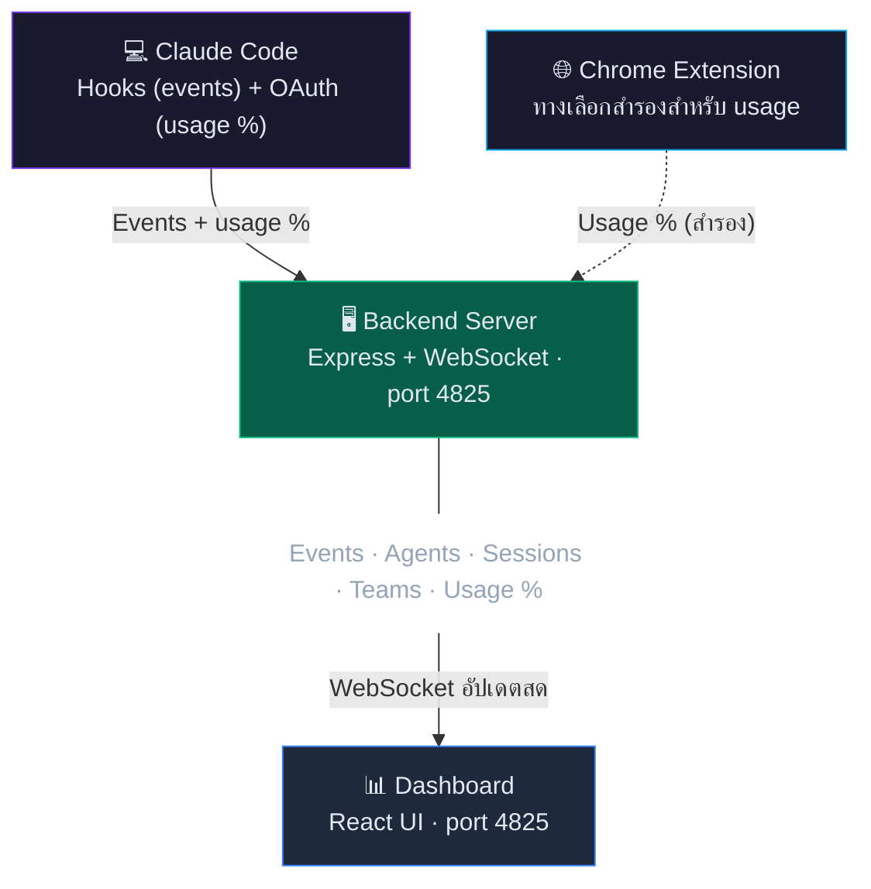

# Oh My Claude

> แดชบอร์ดมอนิเตอร์ Claude Code แบบเรียลไทม์ — ดู token, agent, team, ค่าใช้จ่าย และ activity แบบสดๆ
>
> **🇬🇧 [Read in English](README.md)**


---

## 💡 ทำไมถึงสร้าง

### 🔥 Token หมด — ปัญหาที่เจ็บจริง

- ใช้ Claude Code แบบลื่นๆ ลุยงานไม่หยุด ฟีเจอร์แล้วฟีเจอร์เล่า... แล้วก็ **ปัง — rate limit hit**
- Session 5 ชั่วโมงหมดเกลี้ยง ไม่ทันรู้ตัวเลย
- ต้องการวิธีดู usage **ระหว่างทำงาน** ไม่ใช่รู้ตอนที่มันสายไปแล้ว

**ทางออก → Token Usage panel พร้อมนับถอยหลัง:**

| | Session | Weekly |
|---|---------|--------|
| **เหลืออีก** | 1h 18m | 5d 23h |
| **ใช้ไป** | 60% | 19% |

- Status badge เตือนให้: 🪴 ปกติ → ⚡ สูง → 🚨 ใกล้เต็ม → 🫗 เต็มแล้ว
- ตอนนี้ pace ตัวเองได้ ไม่ต้องนั่งรอ 5 ชั่วโมงด้วยความเจ็บปวดอีกแล้ว

### 🤖 "Agent ทำอะไรกันอยู่?"

- Opus 4.8 ปล่อย team agents — code-reviewer, worker, reviewer-2 — แล้ว **มันทำอะไรกันอยู่?**
- อยากเห็น: ใครกำลัง active, ใช้ tool อะไร, กิน token ไปเท่าไหร่แล้ว
- **Team Comms** — มันคุยกันจริงๆ (broadcast, DM, สั่งงาน) ดูสนุกมาก
- **Subagents** — ดูมัน spawn มา ทำงาน แล้วก็ตาย วงจรชีวิต AI
- Session % ตอน team agents ทำงาน? หมด *เร็วจนขำ* เหมือนดูแบตมือถือตอน video call 555

เริ่มจาก "quota เหลือเท่าไหร่?" → กลายเป็นหน้าต่างมองเข้าไปว่า Claude Code ทำงานยังไงจริงๆ

---

## ✨ ฟีเจอร์

| ฟีเจอร์ | รายละเอียด |
|---------|-------------|
| **Token Tracking** | ดู Session (5h) & Weekly พร้อมนับถอยหลังและแยกตาม model |
| **Burn Pace** | ตัวบอกความเร็วการเผา token แบบสด — ใช้เร็วแค่ไหนเทียบกับเวลาที่ผ่านไป พร้อม ETA จนถึง limit (แสดงเมื่อจำเป็น) |
| **Agent Monitoring** | ดู main agent + subagents แบบ tree พร้อม status, token, tool ที่ใช้ และ git diff ต่อ session |
| **Context Window %** | % การเติม context ต่อ session (stuck-detection) จาก status line / transcript ของ Claude Code |
| **Reply Timeline** | ไล่ดูข้อความตอบของ session — ค้นหาได้ คัดลอกได้ สไตล์แบบ Claude |
| **Live Reply Push** | ข้อความตอบล่าสุด stream ผ่าน WebSocket; แถวที่รอ prompt จะหรี่ลงจนกว่าคำตอบจะมา |
| **Team Monitoring** | ติดตาม team agents พร้อม token growth อิสระและคำเตือนสถานะสมาชิก |
| **Team Comms** | ข้อความระหว่าง agent (broadcast, DM, task update) แสดงแบบเรียลไทม์ |
| **Activity Feed** | Tool calls, prompts, errors ไหลมาสดๆ พร้อมฟิลเตอร์ event type |
| **Token Breakdown** | ชิป `session · total · reuse×N` พร้อม popover รายละเอียด cache |
| **Cost Estimation** | ค่าใช้จ่ายรายเดือนแยกตาม model (Opus / Sonnet / Haiku) |
| **Last 12 Hours** | กราฟแท่ง token รายชั่วโมงแยกตาม model |
| **Event Details** | คลิก event ดู Input/Output ใน footer detail panel |
| **3 โหมดหน้าต่าง** | Full (965×870), Medium (300×870), Mini (280×400) pop-out |
| **Install as App** | PWA — ติดตั้งเป็นแอปบน desktop ได้เลย |
| **Dark / Light Theme** | ระบบธีมครบวงจรพร้อม semantic color tokens — อ่านง่ายทั้งโหมดมืดและสว่าง |
| **Notifications** | แจ้งเตือน desktop สำหรับ events |
| **Bilingual Guide** | คู่มือใน app EN/TH (11 หมวด) |
| **Auto Usage Sync** | Session/weekly % sync อัตโนมัติจาก OAuth token ของ Claude Code — ไม่ต้องเปิด browser หรือ extension; คงค่าข้าม restart |
| **Demo Mode** | เล่นซ้ำ ~1,000 events จริงพร้อม retro tape counter UI |

### ตัวบอกสถานะ Usage

| ไอคอน | สถานะ | ช่วง |
|------|--------|-------|
| 🪴 | ปกติ | < 60% |
| ⚡ | สูง | 60–84% |
| 🚨 | ใกล้เต็ม | 85–99% |
| 🫗 | เต็มแล้ว | 100% |

---

## 🚀 เริ่มต้นใช้งาน

### สิ่งที่ต้องมี

| ต้องการ | เวอร์ชัน | ตรวจสอบ |
|---------|---------|---------|
| **Node.js** | 18+ | `node --version` |
| **npm** | 9+ | `npm --version` |
| **Claude Code** | ล่าสุด | `claude --version` |

### ขั้นตอน 1: Clone & Install

```bash
git clone https://github.com/suparerk9x/Oh-My-Claude.git
cd Oh-My-Claude
npm run install:all
```

### ขั้นตอน 2: ตั้งค่า Claude Code Hooks

> **จำเป็น** — ถ้าไม่มี hooks, dashboard จะไม่ได้รับ event ใดๆ

แก้ไขไฟล์ settings ของ Claude:

| OS | Path |
|----|------|
| Windows | `C:\Users\<username>\.claude\settings.json` |
| macOS / Linux | `~/.claude/settings.json` |

เพิ่มส่วน `hooks` — เปลี่ยน `<PATH>` เป็น path ของโฟลเดอร์ Oh-My-Claude:

<details>
<summary>📋 คลิกเพื่อดู hooks JSON config</summary>

```json
{
  "hooks": {
    "PreToolUse": [
      {
        "matcher": "",
        "hooks": [
          {
            "type": "command",
            "command": "node \"<PATH>/Oh-My-Claude/hooks/send_event.js\" --event-type PreToolUse"
          }
        ]
      }
    ],
    "PostToolUse": [
      {
        "matcher": "",
        "hooks": [
          {
            "type": "command",
            "command": "node \"<PATH>/Oh-My-Claude/hooks/send_event.js\" --event-type PostToolUse"
          }
        ]
      }
    ],
    "SubagentStart": [
      {
        "hooks": [
          {
            "type": "command",
            "command": "node \"<PATH>/Oh-My-Claude/hooks/send_event.js\" --event-type SubagentStart"
          }
        ]
      }
    ],
    "SubagentStop": [
      {
        "hooks": [
          {
            "type": "command",
            "command": "node \"<PATH>/Oh-My-Claude/hooks/send_event.js\" --event-type SubagentStop"
          }
        ]
      }
    ],
    "UserPromptSubmit": [
      {
        "hooks": [
          {
            "type": "command",
            "command": "node \"<PATH>/Oh-My-Claude/hooks/send_event.js\" --event-type UserPromptSubmit"
          }
        ]
      }
    ],
    "Stop": [
      {
        "hooks": [
          {
            "type": "command",
            "command": "node \"<PATH>/Oh-My-Claude/hooks/send_event.js\" --event-type Stop"
          }
        ]
      }
    ],
    "PreCompact": [
      {
        "hooks": [
          {
            "type": "command",
            "command": "node \"<PATH>/Oh-My-Claude/hooks/send_event.js\" --event-type PreCompact"
          }
        ]
      }
    ],
    "Notification": [
      {
        "hooks": [
          {
            "type": "command",
            "command": "node \"<PATH>/Oh-My-Claude/hooks/send_event.js\" --event-type Notification"
          }
        ]
      }
    ],
    "PermissionRequest": [
      {
        "hooks": [
          {
            "type": "command",
            "command": "node \"<PATH>/Oh-My-Claude/hooks/send_event.js\" --event-type PermissionRequest"
          }
        ]
      }
    ],
    "SessionStart": [
      {
        "hooks": [
          {
            "type": "command",
            "command": "node \"<PATH>/Oh-My-Claude/hooks/send_event.js\" --event-type SessionStart"
          }
        ]
      }
    ],
    "SessionEnd": [
      {
        "hooks": [
          {
            "type": "command",
            "command": "node \"<PATH>/Oh-My-Claude/hooks/send_event.js\" --event-type SessionEnd"
          }
        ]
      }
    ],
    "TeammateIdle": [
      {
        "hooks": [
          {
            "type": "command",
            "command": "node \"<PATH>/Oh-My-Claude/hooks/send_event.js\" --event-type TeammateIdle"
          }
        ]
      }
    ],
    "TaskCompleted": [
      {
        "hooks": [
          {
            "type": "command",
            "command": "node \"<PATH>/Oh-My-Claude/hooks/send_event.js\" --event-type TaskCompleted"
          }
        ]
      }
    ]
  }
}
```

</details>

**ตัวอย่าง path** (ใช้ forward slash `/` แม้บน Windows):

| OS | ตัวอย่าง |
|----|---------|
| Windows | `node "D:/Projects/Oh-My-Claude/hooks/send_event.js" --event-type PreToolUse` |
| macOS | `node "/Users/john/Oh-My-Claude/hooks/send_event.js" --event-type PreToolUse` |

### ขั้นตอน 3: Sync Usage % (อัตโนมัติ)

> Session/weekly % และตัวนับถอยหลัง sync อัตโนมัติจาก OAuth token ของ Claude Code บนเครื่องนี้ — **ไม่ต้องติดตั้งอะไร** แค่ login Claude Code (`claude` CLI) ค้างไว้ ถ้า Claude Code อยู่*คนละเครื่อง*กับ dashboard ดูทางเลือกสำรองที่หมวด [Chrome Extension](#-chrome-extension-ทางเลือกสำรอง)

> **เสริม — context % ที่แม่นขึ้น:** % context window ต่อ session ทำงานผ่าน hooks ข้างบนอยู่แล้ว (hook อ่าน transcript) ถ้าอยากได้ตัวเลขแม่นแบบเรียลไทม์ที่สุด ตั้งค่า `statusLine` ของ Claude Code ให้ชี้ไป `hooks/statusline_wrapper.js` ได้ มันจะรายงาน context % มาที่ dashboard พร้อมกับแสดง status line ของคุณ — เป็นออปชันเสริม ไม่บังคับ

### ขั้นตอน 4: เริ่มใช้งาน

**Windows:**

```bash
start.bat
```

**ทุก OS:**

```bash
npm run dev
```

- **`start.bat`** รันแอปผ่าน **PM2** เป็น process เดียวที่ **http://localhost:4825** — UI, API และ WebSocket รวมกัน พร้อม auto-restart และ start ตอน boot (วิธีใช้งานปกติ)
- **`npm run dev`** รัน dev server แทน: backend ที่ **4825** + Vite HMR frontend ที่ **5173** (เปิด **5173** สำหรับ live-reload ตอนแก้ UI)

### ขั้นตอน 5: เปิด Dashboard

เปิด **http://localhost:4825** (หรือ **http://localhost:5173** ถ้าใช้ `npm run dev`) — ควรจะเห็น:

- Header แสดง **LIVE** (จุดเขียว)
- สถานะ Backend แสดง **OK**

---

## 🏗️ สถาปัตยกรรมระบบ



**การไหลของข้อมูล:**

1. **Claude Code** → Hooks ยิง events (PreToolUse, PostToolUse, SubagentStart/Stop, SessionStart/End ฯลฯ) → `POST /events` → Backend
2. **Claude Code OAuth** → Backend อ่าน OAuth token ในเครื่อง (`~/.claude/.credentials.json`) แล้ว query usage % จาก Anthropic (ทุก 60 วินาที ไม่ต้องเปิด browser) → เป็นตัวเลขเดียวกับ panel "Account & Usage" ของ Claude Code; backend คำนวณ **burn pace** + **ETA** จากหน้าต่างตัวอย่าง 12 นาทีย้อนหลัง และเก็บ snapshot ล่าสุดไว้ให้ gauge ไม่ว่างเปล่าหลัง restart
3. **Status line / transcript** *(เสริม)* → `statusline_wrapper.js` (หรือการอ่าน transcript ใน `send_event.js`) → `POST /context-update` → **context window %** ต่อ session สำหรับ stuck-detection
4. **Chrome Extension** *(ทางเลือกสำรอง)* → ดึง usage % จาก claude.ai → `POST /usage` ใช้เฉพาะกรณี Claude Code ไม่ได้อยู่บนเครื่องนี้
5. **Backend** → รวมข้อมูลทั้งหมด → กระจายผ่าน WebSocket (พอร์ตเดียว 4825)
6. **Dashboard** → รับผ่าน WebSocket → แสดงผลแบบเรียลไทม์

---

## 🌐 Chrome Extension (ทางเลือกสำรอง)

> **ปกติไม่จำเป็นต้องใช้** usage % sync อัตโนมัติจาก OAuth token ของ Claude Code บนเครื่องเดียวกันอยู่แล้ว (ดูขั้นตอน 3) extension มีประโยชน์เฉพาะกรณีที่ Claude Code อยู่*คนละเครื่อง*กับ dashboard — มันจะยืม session ของ claude.ai ใน browser แทนการอ่าน token ในเครื่อง

Sync % การใช้งานจาก Claude.ai มาที่ dashboard ทุก 1 นาที ผ่าน browser

### ติดตั้ง

1. เปิด `chrome://extensions/`
2. เปิด **Developer mode** (มุมขวาบน)
3. กด **Load unpacked** → เลือกโฟลเดอร์ `extension/`
4. เปิด [claude.ai](https://claude.ai) สักครั้งเพื่อ login (extension จะจับ session ไว้)

### วิธีทำงาน

```
Claude.ai → Extension (ดึง API ทุก 1 นาที) → Backend :4825 → Dashboard
```

1. Extension ตรวจจับ organization และเริ่ม sync
2. Header ของ dashboard แสดง **Sync** badge พร้อมสถานะตลกๆ
3. Token Usage panel อัปเดต session % พร้อมนับถอยหลังแบบสดๆ

> **หมายเหตุ:** ต้อง login เข้า claude.ai ครั้งแรกเพื่อให้ extension จับ session cookie ได้ หลังจากนั้น sync ทำงานใน background ได้เลย — ไม่ต้องเปิด tab ค้างไว้

---

## 💻 ติดตั้งเป็นแอป Desktop (PWA)

Oh My Claude รองรับ **Progressive Web App** — ติดตั้งเป็นแอป standalone บน desktop ได้:

1. เปิด **http://localhost:4825** ใน Chrome
2. กดไอคอน **Install app** (จอมอนิเตอร์มีลูกศรลง) ที่ address bar
3. กด **"Install"** ในป๊อปอัพ
4. แอปเปิดในหน้าต่างของตัวเอง — pin ไว้ที่ taskbar ได้เลย!

**ข้อดี:**
- ทำงานในหน้าต่างเรียบๆ ไม่มี tab หรือ address bar
- Pin ไว้ที่ taskbar / dock เข้าถึงเร็ว
- ใช้งานเหมือนแอป desktop จริงๆ

> **หมายเหตุ:** Backend ต้องรันอยู่ (ผ่าน `start.bat` / PM2 หรือ `npm run dev`) ที่พอร์ต 4825

---

## 🪟 โหมดหน้าต่าง

Oh My Claude มี layout หน้าต่างแยกกัน **3 แบบ** แต่ละแบบเป็น HTML entry ที่ Vite build ต่างหาก — ใช้ feed WebSocket สดตัวเดียวกันหมด:

| โหมด | ขนาด | Entry | เหมาะกับ |
|------|------|-------|----------|
| **Full** | 965×870 | `full.html` (`/full`) | dashboard 3 พาเนลเต็ม — token usage, agent tree, activity feed |
| **Medium** | 300×870 | `medium.html` (`/medium`) | แถบข้างทรงสูง: gauges + agents + activity feed ที่พับเก็บได้ |
| **Mini** | 280×400 | `mini.html` (`/mini`) | ย่อสุด: สถานะเชื่อมต่อ, gauge bar, รายชื่อ session, smart status |

- เปิด **Medium** หรือ **Mini** ได้จากปุ่ม pop-out (↗) ใน toolbar
- ทุกหน้าต่าง sync ธีม (dark/light) และ demo mode แบบสองทางกับหน้าหลัก
- route เริ่มต้น (`/`, `index.html`) แสดง layout แบบ Medium — เหมาะใช้เป็นหน้าต่าง PWA ที่ติดตั้ง
- เหมาะสำหรับเปิดมอนิเตอร์เล็กๆ ไว้ข้างๆ ตอน code

---

## 🎬 Demo Mode

ลองใช้ dashboard เต็มรูปแบบโดยไม่ต้องมี Claude Code session จริง — เล่นซ้ำ ~1,000 events จริงพร้อม simulated data

### วิธีเปิดใช้

1. เปิด **Dashboard Guide** (ปุ่ม ? ใน toolbar)
2. กดปุ่ม **Demo** ที่ header ของ guide
3. Header เปลี่ยนจาก **LIVE** เป็น **DEMO** พร้อมแสงสีส้ม

### ควบคุมการเล่น

ปุ่มควบคุมสไตล์ retro tape counter จะปรากฏข้าง DEMO badge:

| ปุ่ม | รายละเอียด |
|------|-------------|
| **Counter** | เคาน์เตอร์ LED ดิจิทัล (Share Tech Mono font) แสดงเลข event ปัจจุบัน ตัวเลขหมุนขึ้น |
| **Play / Pause** | เริ่มเล่น event กดอีกทีเพื่อ pause — เคาน์เตอร์หยุด state คงอยู่ |
| **Reset** | หยุดและล้างทุกอย่าง เคาน์เตอร์กลับไป 0000 |

### สถานะการเล่น

| สถานะ | รายละเอียด |
|-------|-------------|
| **Idle** | เริ่มต้น — เคาน์เตอร์แสดง 0000, dashboard ว่าง |
| **Playing** | Events เล่นซ้ำด้วยความเร็วต่างกันตาม event type |
| **Paused** | หยุดค้าง — ข้อมูลทั้งหมดยังแสดงอยู่ |
| **Finished** | เล่นครบ ~1,000 events — dashboard แสดงสถานะสุดท้าย |

### ความเร็ว Event

| Event Type | หน่วง | หมายเหตุ |
|------------|-------|----------|
| `UserPromptSubmit` | 600ms | ข้อความผู้ใช้ — หน่วงนานสุด |
| `SubagentStart/Stop`, `Stop` | 400ms | Agent lifecycle |
| `PermissionRequest` | 300ms | คำขอ permission |
| `SendMessage/TeamCreate/Task` | 250ms | Team operations |
| `PreCompact/TeammateIdle` | 200–250ms | context & idle |
| `PreToolUse/PostToolUse` | 80ms | Tool calls — เร็วสุด |

### สิ่งที่จำลอง

- **Token Usage** — Session 30%, Weekly 17% พร้อมนับถอยหลังและกราฟ Last 12 Hours
- **Agents Panel** — Main session spawn, subagents ปรากฏพร้อม tool activity จริง
- **Team Agents** — สมาชิก 3 คน (code-reviewer, worker, reviewer-2) พร้อม token growth อิสระ
- **Team Comms** — 8 ข้อความระหว่าง agent ไหลระหว่างเล่น
- **Activity Feed** — Read, Write, Edit, Bash, Grep, Glob, TodoWrite events ไหลเข้ามาสดๆ
- **Event Details** — คลิก event ดู Input/Output ใน footer
- **Footer Stats** — จำนวน event, ค่าใช้จ่ายรายเดือน ($7,867), แยกตาม model
- **Status Badge** — Header แสดงสถานะ usage พร้อม %

### แหล่งข้อมูล Demo

Events จับมาจาก Claude Code session จริงโดยใช้ `scripts/prepare-demo-data.js` แปลง `backend/events.json` เป็น dataset ที่ `frontend/src/data/demoData.js`

---

## 📁 โครงสร้างโปรเจค

```
Oh-My-Claude/
├── package.json              # Root scripts (npm run dev, install:all) — name: claude-agent-monitor
├── start.bat                 # Windows quick start (รัน backend ผ่าน PM2)
├── restart-safe.ps1          # Restart backend ผ่าน PM2 (ใส่ -Build เพื่อ build frontend ก่อน)
├── create-shortcut.bat       # สร้าง desktop shortcut (Windows .bat)
├── create-shortcut.ps1       # สร้าง desktop shortcut (PowerShell)
├── README.md                 # เอกสาร (EN)
├── README_TH.md              # เอกสาร (TH)
│
├── backend/
│   ├── server.js             # Express + WebSocket server ทั้งหมดบนพอร์ต 4825
│   ├── statsReader.js        # อ่าน transcript .jsonl สำหรับ token/cost stats
│   ├── ecosystem.config.cjs  # PM2 process config (app: omc-backend)
│   ├── events.json           # ประวัติ event — 1,000 ล่าสุด, sanitize แล้ว (สร้างอัตโนมัติ)
│   ├── agents.json           # สถานะ agent (สร้างอัตโนมัติ)
│   ├── usage-snapshot.json   # snapshot usage % ล่าสุด — คงค่าข้าม restart (gitignore)
│   ├── usage-history.json    # ประวัติ sample สำหรับ burn-rate (gitignore)
│   ├── logs/                 # PM2 out/error logs
│   └── __tests__/            # Jest tests
│
├── frontend/
│   ├── index.html            # Entry เริ่มต้น (แสดง layout Medium)
│   ├── full.html             # Entry Full dashboard (965×870)
│   ├── medium.html           # Entry หน้าต่าง Medium (300×870)
│   ├── mini.html             # Entry mini pop-out (280×400)
│   ├── vite.config.js        # Vite multi-entry build + dev proxy → 4825
│   ├── tailwind.config.js    # Tailwind CSS config
│   ├── postcss.config.js     # PostCSS config
│   ├── .env / .env.production # API/WS base URL
│   ├── public/
│   │   ├── favicon.svg       # ไอคอนแอป
│   │   ├── manifest.json     # PWA manifest
│   │   └── sw.js             # Service worker สำหรับ PWA
│   └── src/
│       ├── App.jsx           # Full dashboard (3 พาเนล)
│       ├── MediumApp.jsx     # layout หน้าต่าง Medium
│       ├── MiniApp.jsx       # หน้าต่าง mini pop-out
│       ├── main.jsx          # Entry เริ่มต้น → MediumApp + PWA registration
│       ├── full-main.jsx     # Entry Full → App
│       ├── medium-main.jsx   # Entry Medium → MediumApp
│       ├── mini-main.jsx     # Entry mini → MiniApp
│       ├── index.css         # Global styles (Tailwind imports)
│       ├── config/
│       │   ├── theme.js      # ระบบธีม dark/light (model, tool, event, agent, team, semantic… tokens)
│       │   └── eventTypes.js # นิยาม event type (สีปรับตามธีม)
│       ├── data/
│       │   └── demoData.js   # ชุดข้อมูล demo (~1,000 events + metadata session/agent/comms)
│       ├── hooks/
│       │   ├── useDemoReplay.js     # State machine สำหรับ demo replay
│       │   ├── useNotifications.js  # แจ้งเตือน desktop
│       │   └── usePolling.js        # API polling hook
│       ├── utils/
│       │   └── format.js     # จัดรูปแบบ token/ตัวเลข + usage badge + burn-speed
│       ├── test/
│       │   └── setup.js      # Vitest + jsdom setup
│       └── components/
│           ├── AgentTree.jsx       # Agent tree + reply timeline + background jobs
│           ├── AgentCard.jsx       # แสดง agent เดี่ยว
│           ├── ActivityItem.jsx    # รายการ event
│           ├── TokenGauge.jsx      # gauge usage (segment, time-marker, burn pace, นับถอยหลัง reset)
│           ├── TokenBreakdown.jsx  # ชิป token breakdown + popover cache
│           ├── TokenStats.jsx      # สถิติ cost แยกตาม model
│           ├── HourlyBreakdown.jsx # กราฟแท่ง 12 ชม.ล่าสุด
│           └── HelpGuide.jsx       # คู่มือ (EN/TH, 11 หมวด)
│
├── hooks/
│   ├── send_event.js         # Hook script (อ่าน stdin) → POST /events + /context-update
│   ├── send_event_env.js     # variant ที่อ่าน hook data จาก env vars
│   └── statusline_wrapper.js # ตัวห่อ status line → POST /context-update (context %)
│
├── scripts/
│   └── prepare-demo-data.js  # แปลง events.json จริง → demoData.js
│
├── extension/                # Chrome extension (ทางเลือกสำรองสำหรับ usage)
│   ├── manifest.json         # Manifest V3
│   ├── background.js         # Background sync worker (alarm 1 นาที)
│   ├── content.js            # ดึง usage จาก claude.ai
│   ├── README.md             # เอกสาร extension
│   └── icons/                # ไอคอน extension (16/48/128)
│
└── docs/
    ├── AUDIT-REPORT.md            # รายงาน audit โค้ด
    ├── CODE_REVIEW.md             # บันทึก code review
    ├── CONTEXT_WINDOW_ACCURACY.md # ทำไม ctx % บน dashboard อาจต่างจาก Claude Code
    └── claude-logo.svg            # ไฟล์โลโก้
```

---

## ⚙️ การตั้งค่า

### Ports

| Service | Port | ไฟล์ |
|---------|------|------|
| App — backend เสิร์ฟ UI + API + WS (PM2: `omc-backend`) | 4825 | `backend/server.js` |
| Vite dev server — เฉพาะตอน `npm run dev`, proxy ไป 4825 | 5173 | `frontend/vite.config.js` |

### ความปลอดภัย

| ฟีเจอร์ | รายละเอียด |
|---------|---------|
| **CORS** | จำกัดเฉพาะ localhost origins (4825, 5173) |
| **Rate Limiting** | ทั่วไป: 1,000 req/15min, Events: 300/min |
| **Input Validation** | ตรวจสอบ Zod schema ทุก POST endpoint |
| **Path Traversal** | Sanitize file paths ใน statsReader |

### วงจรสถานะ Agent

| สถานะ | Timeout | รายละเอียด |
|--------|---------|-------------|
| Active | — | กำลังรับ events (เขียว) |
| Idle | 3 นาที | ไม่มี events 3 นาที (เหลือง) |
| Stale | 8 นาที | ไม่มี events 8 นาที (ส้ม) |
| Timeout | 20 นาที | ไม่มี events 20 นาที (เทา) |
| Removed | 30 นาที | ถูกลบออกจากรายชื่อ agent |

> **หมายเหตุ:** เมื่อ agent idle สถานะอัจฉริยะจะเปลี่ยนเป็น "Stopped" อัตโนมัติ
> ถ้าปิด IDE โดยไม่ graceful exit ระบบ timeout จะจัดการ cleanup ให้

### NPM Scripts

| Script | รายละเอียด |
|--------|-------------|
| `npm run dev` | เริ่ม backend + frontend พร้อมกัน |
| `npm run install:all` | ติดตั้ง dependencies ทั้งหมด |
| `npm run build` | Build frontend สำหรับ production |
| `npm run dev:backend` | เริ่มเฉพาะ backend |
| `npm run dev:frontend` | เริ่มเฉพาะ frontend |

---

## 🖥️ Layout ของ Dashboard

```
┌─────────────────────────────────────────────────────┐
│  Header: LIVE · Sync · Toolbar · Clock · Status     │
├───────────┬──────────────┬──────────────────────────┤
│  Token    │   Agents     │   Activity Feed          │
│  Usage    │   Tree       │   (events เรียลไทม์)     │
│  (200px)  │   (340px)    │   (flex)                 │
├───────────┴──────────────┴──────────────────────────┤
│  Event Detail Panel (ขยายได้)                        │
├─────────────────────────────────────────────────────┤
│  Footer: Event Filters │ ค่าใช้จ่ายรายเดือน │ Clock │
└─────────────────────────────────────────────────────┘
```

### Header Toolbar

| ปุ่ม | รายละเอียด |
|------|-------------|
| **View Mode** | สลับพาเนล agent: Full → Compact → Focus → Expanded → Hidden |
| **Theme** | สลับ Dark / Light |
| **Medium** | เปิดหน้าต่าง medium pop-out (300×870) |
| **Mini** | เปิดหน้าต่าง mini pop-out (280×400) |
| **Notifications** | สลับ: Off / Bell |
| **Guide** | คู่มือพร้อมปุ่ม Demo (11 หมวด, EN/TH) |
| **Status Badge** | สถานะ usage (🪴⚡🚨🫗) |

### สถานะ Agent

| สถานะ | สี | ความหมาย |
|--------|------|---------|
| Active | 🟢 เขียว | กำลังรับ events |
| Idle | 🟡 เหลือง | ไม่มี activity 3+ นาที |
| Stale | 🟠 ส้ม | ไม่มี activity 8+ นาที |
| Stopped | ⚪ เทา | Agent เสร็จ / หยุด |
| Timeout | ⚪ เทา | ไม่มี activity 20+ นาที |

### ไอคอน Model

| Model | ไอคอน | สี |
|-------|------|------|
| Opus 4 | ◆ | ม่วง |
| Sonnet 4 | ● | น้ำเงิน |
| Haiku 3.5 | ▪ | เขียว |

---

## ✅ ตรวจสอบการติดตั้ง

```bash
# Test 1: Backend health
curl http://localhost:4825/health
# → {"status":"ok"}

# Test 2: ส่งข้อความใน Claude Code
# → Events จะปรากฏใน Activity Feed

# Test 3: ดู agents panel
# → Session ของคุณจะแสดงเป็น "Main" agent สีเขียว
```

---

## 🔧 แก้ปัญหา

| ปัญหา | วิธีแก้ |
|--------|---------|
| Dashboard แสดง **OFF** | 1. ตรวจ backend: `curl http://localhost:4825/health` <br> 2. ตรวจ browser console หา WebSocket errors <br> 3. Hard refresh: `Ctrl+Shift+R` |
| ไม่มี events ปรากฏ | 1. ตรวจ hooks ใน `~/.claude/settings.json` <br> 2. ตรวจ path ใช้ forward slash `/` <br> 3. Restart terminal ของ Claude Code |
| Usage % เป็น 0 / ไม่อัปเดต | 1. ตรวจว่า Claude Code login บนเครื่องนี้แล้ว <br> 2. ต้องมีไฟล์ `~/.claude/.credentials.json` <br> 3. ตรวจ backend console หา `[USAGE] Synced from Claude Code OAuth` |
| Extension ไม่ sync (เฉพาะ fallback) | 1. ต้อง login claude.ai <br> 2. ตรวจ extension เปิดอยู่ที่ `chrome://extensions/` <br> 3. ตรวจ backend console หา "Usage received" |
| ติดตั้ง PWA ไม่ได้ | 1. ต้องเข้าผ่าน `http://localhost:4825` (ไม่ใช่ IP) <br> 2. ใช้ Chrome หรือ Edge <br> 3. ตรวจ DevTools → Application → Manifest |
| Demo mode ไม่ทำงาน | 1. เปิด Guide → กดปุ่ม Demo <br> 2. ตรวจ browser console หา errors <br> 3. ตรวจว่ามีไฟล์ `frontend/src/data/demoData.js` |

---

## 📡 API Reference

### REST

> UI ที่ build แล้วเรียก endpoint เหล่านี้ใต้ prefix `/api/*` (เหมือน Vite dev proxy); server จะตัด `/api` ออก ดังนั้น path ข้างล่างเรียกตรงๆ ก็ได้

| Method | Endpoint | รายละเอียด |
|--------|----------|-------------|
| GET | `/health` | Health check (`status`, จำนวน WS client, จำนวน event, uptime) |
| GET | `/stats` | Token stats (cache ~60 วิ) |
| GET | `/events` | Events ล่าสุด (`?type=`, `?limit=`) |
| GET | `/agents` | รายชื่อ agent พร้อมสถานะ, token, context %, git diff |
| GET | `/sessions` | รายชื่อ session (20 อันดับแรกตาม activity ล่าสุด) |
| GET | `/teams` | Teams ที่ active + สมาชิก + file conflict |
| GET | `/teams/:name/comms` | การสื่อสารใน team (50 ล่าสุด) |
| GET | `/teams/:name/files` | ไฟล์ที่แชร์ใน team + ตรวจ conflict |
| GET | `/session/:id/last-message` | ข้อความตอบล่าสุดเต็มๆ ของ session |
| GET | `/session/:id/messages` | reply timeline — ข้อความตอบ (`?limit=`, สูงสุด 500) |
| GET | `/usage` | usage % ปัจจุบัน (OAuth หรือ extension แล้วแต่ตัวไหนใหม่กว่า) |
| POST | `/events` | รับ hook events (ตรวจด้วย Zod, rate-limited: 300/min) |
| POST | `/context-update` | รับ context-window % ต่อ session (status line / transcript) |
| POST | `/usage` | รับข้อมูล usage จาก Chrome extension (สำรอง) |
| POST | `/restart` | restart แบบ graceful (เซฟ state, exit 0 ให้ PM2) |
| DELETE | `/events` | ล้าง events, agents, sessions, teams ทั้งหมด |
| DELETE | `/agents` | ล้าง agents ทั้งหมด (เก็บ events) |
| DELETE | `/agents/stopped` | ล้างเฉพาะ agents ที่หยุด / timeout |

### WebSocket

เชื่อมต่อ: `ws://localhost:4825`

| Message | ทิศทาง | รายละเอียด |
|---------|--------|-------------|
| `init` | Server → Client | สถานะเริ่มต้น (events, stats, agents, sessions, usage, teams, comms) |
| `event` | Server → Client | Event ใหม่มาถึง |
| `stats` | Server → Client | snapshot ตามรอบ (stats, agents, sessions, usage, teams) — ทุก 10 วิ |
| `agents_update` | Server → Client | รายชื่อ agent อัปเดต |
| `usage` | Server → Client | usage % อัปเดต (OAuth sync หรือ extension) |
| `last-message` | Server → Client | ข้อความตอบสดของ session (+ flag `awaitingReply`) |
| `clear` | Server → Client | Events ถูกล้าง |
| `agents_cleared` | Server → Client | Agents ถูกล้าง |

> Dashboard เป็นแบบ push อย่างเดียว — client ไม่ส่ง WebSocket message; การกระทำทั้งหมดผ่าน REST endpoint ข้างบน

---

## 🛠️ Tech Stack

| Layer | เทคโนโลยี |
|-------|------------|
| Backend | Node.js, Express, WebSocket (ws), Zod, express-rate-limit |
| Frontend | React 18, Vite 5, Tailwind CSS, react-markdown + remark-gfm, PropTypes |
| Process mgmt | PM2 (process เดียว `omc-backend`, auto-restart, start ตอน boot) |
| Testing | Jest (backend), Vitest + jsdom (frontend) |
| PWA | Service Worker, Web App Manifest |
| Extension | Chrome Manifest V3 |

---

## 🤝 Contributing

1. Fork repository
2. สร้าง feature branch: `git checkout -b feature/amazing`
3. Commit: `git commit -m 'Add amazing feature'`
4. Push: `git push origin feature/amazing`
5. เปิด Pull Request

---

## 📄 License

MIT
