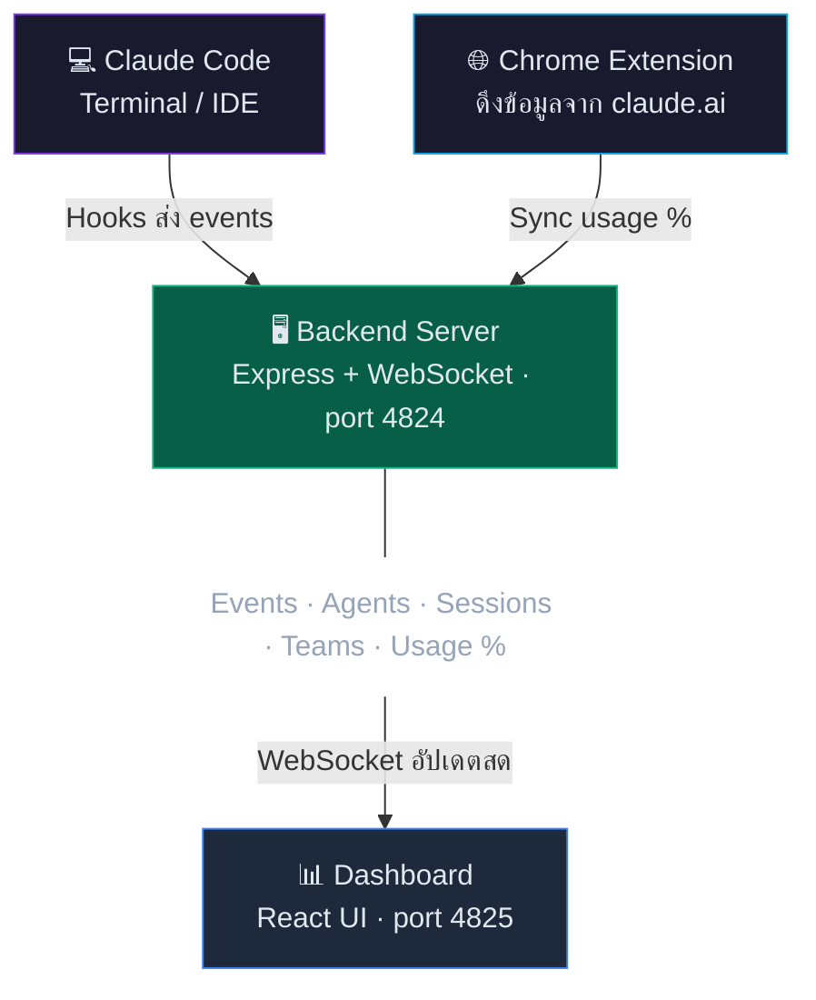

# Oh My Claude

> แดชบอร์ดมอนิเตอร์ Claude Code แบบเรียลไทม์ — ดู token, agent, team, ค่าใช้จ่าย และ activity แบบสดๆ
>
> **🇬🇧 [Read in English](README.md)**


---

## 💡 ทำไมถึงสร้าง

### 🔥 Token หมด — ปัญหาที่เจ็บจริง

- ใช้ Claude Code แบบลื่นๆ ลุยงานไม่หยุด ฟีเจอร์แล้วฟีเจอร์เล่า... แล้วก็ **ปัง — rate limit hit**
- Session 5 ชั่วโมงหมดเกลี้ยง ไม่ทันรู้ตัวเลย
- ต้องการวิธีดู usage **ระหว่างทำงาน** ไม่ใช่รู้ตอนที่มันสายไปแล้ว

**ทางออก → Token Usage panel พร้อมนับถอยหลัง:**

| | Session | Weekly |
|---|---------|--------|
| **เหลืออีก** | 1h 18m | 5d 23h |
| **ใช้ไป** | 60% | 19% |

- Status badge เตือนให้: 🪴 ปกติ → ⚡ สูง → 🚨 ใกล้เต็ม → 🫗 เต็มแล้ว
- ตอนนี้ pace ตัวเองได้ ไม่ต้องนั่งรอ 5 ชั่วโมงด้วยความเจ็บปวดอีกแล้ว

### 🤖 "Agent ทำอะไรกันอยู่?"

- Opus 4.6 ปล่อย team agents — code-reviewer, worker, reviewer-2 — แล้ว **มันทำอะไรกันอยู่?**
- อยากเห็น: ใครกำลัง active, ใช้ tool อะไร, กิน token ไปเท่าไหร่แล้ว
- **Team Comms** — มันคุยกันจริงๆ (broadcast, DM, สั่งงาน) ดูสนุกมาก
- **Subagents** — ดูมัน spawn มา ทำงาน แล้วก็ตาย วงจรชีวิต AI
- Session % ตอน team agents ทำงาน? หมด *เร็วจนขำ* เหมือนดูแบตมือถือตอน video call 555

เริ่มจาก "quota เหลือเท่าไหร่?" → กลายเป็นหน้าต่างมองเข้าไปว่า Claude Code ทำงานยังไงจริงๆ

---

## ✨ ฟีเจอร์

| ฟีเจอร์ | รายละเอียด |
|---------|-------------|
| **Token Tracking** | ดู Session (5h) & Weekly พร้อมนับถอยหลังและแยกตาม model |
| **Agent Monitoring** | ดู main agent + subagents แบบ tree พร้อม status, token, tool ที่ใช้ |
| **Team Monitoring** | ติดตาม team agents พร้อม token growth อิสระและสถานะสมาชิก |
| **Team Comms** | ข้อความระหว่าง agent (broadcast, DM) แสดงแบบเรียลไทม์ |
| **Activity Feed** | Tool calls, prompts, errors ไหลมาสดๆ พร้อมฟิลเตอร์ event type |
| **Cost Estimation** | ค่าใช้จ่ายรายเดือนแยกตาม model (Opus / Sonnet / Haiku) |
| **Last 12 Hours** | กราฟแท่ง token รายชั่วโมงแยกตาม model |
| **Event Details** | คลิก event ดู Input/Output ใน footer detail panel |
| **Mini Pop-out** | หน้าต่างลอย 280x400px สำหรับดูระหว่างทำงาน |
| **Install as App** | PWA — ติดตั้งเป็นแอปบน desktop ได้เลย |
| **Dark / Light Theme** | สลับธีมมืด / สว่าง |
| **Notifications** | แจ้งเตือน desktop สำหรับ events |
| **Bilingual Guide** | คู่มือใน app EN/TH (11 หมวด) |
| **Chrome Extension** | Sync usage % จาก Claude.ai อัตโนมัติ — **แนะนำอย่างยิ่ง** |
| **Demo Mode** | เล่นซ้ำ 1,006 events จริงพร้อม retro tape counter UI |

### ตัวบอกสถานะ Usage

| ไอคอน | สถานะ | ช่วง |
|------|--------|-------|
| 🪴 | ปกติ | < 60% |
| ⚡ | สูง | 60–84% |
| 🚨 | ใกล้เต็ม | 85–99% |
| 🫗 | เต็มแล้ว | 100% |

---

## 🚀 เริ่มต้นใช้งาน

### สิ่งที่ต้องมี

| ต้องการ | เวอร์ชัน | ตรวจสอบ |
|---------|---------|---------|
| **Node.js** | 18+ | `node --version` |
| **npm** | 9+ | `npm --version` |
| **Claude Code** | ล่าสุด | `claude --version` |

### ขั้นตอน 1: Clone & Install

```bash
git clone https://github.com/suparerk9x/Oh-My-Claude.git
cd Oh-My-Claude
npm run install:all
```

### ขั้นตอน 2: ตั้งค่า Claude Code Hooks

> **จำเป็น** — ถ้าไม่มี hooks, dashboard จะไม่ได้รับ event ใดๆ

แก้ไขไฟล์ settings ของ Claude:

| OS | Path |
|----|------|
| Windows | `C:\Users\<username>\.claude\settings.json` |
| macOS / Linux | `~/.claude/settings.json` |

เพิ่มส่วน `hooks` — เปลี่ยน `<PATH>` เป็น path ของโฟลเดอร์ Oh-My-Claude:

<details>
<summary>📋 คลิกเพื่อดู hooks JSON config</summary>

```json
{
  "hooks": {
    "PreToolUse": [
      {
        "matcher": "",
        "hooks": [
          {
            "type": "command",
            "command": "node \"<PATH>/Oh-My-Claude/hooks/send_event.js\" --event-type PreToolUse"
          }
        ]
      }
    ],
    "PostToolUse": [
      {
        "matcher": "",
        "hooks": [
          {
            "type": "command",
            "command": "node \"<PATH>/Oh-My-Claude/hooks/send_event.js\" --event-type PostToolUse"
          }
        ]
      }
    ],
    "SubagentStart": [
      {
        "hooks": [
          {
            "type": "command",
            "command": "node \"<PATH>/Oh-My-Claude/hooks/send_event.js\" --event-type SubagentStart"
          }
        ]
      }
    ],
    "SubagentStop": [
      {
        "hooks": [
          {
            "type": "command",
            "command": "node \"<PATH>/Oh-My-Claude/hooks/send_event.js\" --event-type SubagentStop"
          }
        ]
      }
    ],
    "UserPromptSubmit": [
      {
        "hooks": [
          {
            "type": "command",
            "command": "node \"<PATH>/Oh-My-Claude/hooks/send_event.js\" --event-type UserPromptSubmit"
          }
        ]
      }
    ],
    "Stop": [
      {
        "hooks": [
          {
            "type": "command",
            "command": "node \"<PATH>/Oh-My-Claude/hooks/send_event.js\" --event-type Stop"
          }
        ]
      }
    ],
    "PreCompact": [
      {
        "hooks": [
          {
            "type": "command",
            "command": "node \"<PATH>/Oh-My-Claude/hooks/send_event.js\" --event-type PreCompact"
          }
        ]
      }
    ],
    "Notification": [
      {
        "hooks": [
          {
            "type": "command",
            "command": "node \"<PATH>/Oh-My-Claude/hooks/send_event.js\" --event-type Notification"
          }
        ]
      }
    ],
    "PermissionRequest": [
      {
        "hooks": [
          {
            "type": "command",
            "command": "node \"<PATH>/Oh-My-Claude/hooks/send_event.js\" --event-type PermissionRequest"
          }
        ]
      }
    ],
    "SessionStart": [
      {
        "hooks": [
          {
            "type": "command",
            "command": "node \"<PATH>/Oh-My-Claude/hooks/send_event.js\" --event-type SessionStart"
          }
        ]
      }
    ],
    "SessionEnd": [
      {
        "hooks": [
          {
            "type": "command",
            "command": "node \"<PATH>/Oh-My-Claude/hooks/send_event.js\" --event-type SessionEnd"
          }
        ]
      }
    ]
  }
}
```

</details>

**ตัวอย่าง path** (ใช้ forward slash `/` แม้บน Windows):

| OS | ตัวอย่าง |
|----|---------|
| Windows | `node "D:/Projects/Oh-My-Claude/hooks/send_event.js" --event-type PreToolUse` |
| macOS | `node "/Users/john/Oh-My-Claude/hooks/send_event.js" --event-type PreToolUse` |

### ขั้นตอน 3: ติดตั้ง Chrome Extension

> **แนะนำอย่างยิ่ง** — นี่คือวิธีที่ Token Usage panel ได้ข้อมูล session/weekly % และนับถอยหลัง ดูรายละเอียดที่หมวด [Chrome Extension](#-chrome-extension-แนะนำอย่างยิ่ง)

### ขั้นตอน 4: เริ่มใช้งาน

**Windows:**

```bash
start.bat
```

**ทุก OS:**

```bash
npm run dev
```

รัน backend (port 4824) และ frontend (port 4825) พร้อมกัน

### ขั้นตอน 5: เปิด Dashboard

เปิด **http://localhost:4825** — ควรจะเห็น:

- Header แสดง **LIVE** (จุดเขียว)
- สถานะ Backend แสดง **OK**

---

## 🏗️ สถาปัตยกรรมระบบ



**การไหลของข้อมูล:**

1. **Claude Code** → Hooks ยิง events (PreToolUse, PostToolUse, SessionStart, SessionEnd ฯลฯ) → Backend
2. **Chrome Extension** → ดึง usage % จาก claude.ai → Backend (ทุก 1 นาที)
3. **Backend** → รวมข้อมูลทั้งหมด → กระจายผ่าน WebSocket
4. **Dashboard** → รับผ่าน WebSocket → แสดงผลแบบเรียลไทม์

---

## 🌐 Chrome Extension (แนะนำอย่างยิ่ง)

> **นี่คือวิธีที่ Token Usage panel ได้ข้อมูลมา** ถ้าไม่มี extension จะไม่เห็น session/weekly usage % หรือนับถอยหลัง — ซึ่งเป็นฟีเจอร์หลักที่ป้องกันไม่ให้ token หมดโดยไม่รู้ตัว

Sync % การใช้งานจาก Claude.ai มาที่ dashboard ทุก 1 นาที อัตโนมัติ

### ติดตั้ง

1. เปิด `chrome://extensions/`
2. เปิด **Developer mode** (มุมขวาบน)
3. กด **Load unpacked** → เลือกโฟลเดอร์ `extension/`
4. เปิด [claude.ai](https://claude.ai) สักครั้งเพื่อ login (extension จะจับ session ไว้)

### วิธีทำงาน

```
Claude.ai → Extension (ดึง API ทุก 1 นาที) → Backend :4824 → Dashboard
```

1. Extension ตรวจจับ organization และเริ่ม sync
2. Header ของ dashboard แสดง **Sync** badge พร้อมสถานะตลกๆ
3. Token Usage panel อัปเดต session % พร้อมนับถอยหลังแบบสดๆ

> **หมายเหตุ:** ต้อง login เข้า claude.ai ครั้งแรกเพื่อให้ extension จับ session cookie ได้ หลังจากนั้น sync ทำงานใน background ได้เลย — ไม่ต้องเปิด tab ค้างไว้

---

## 💻 ติดตั้งเป็นแอป Desktop (PWA)

Oh My Claude รองรับ **Progressive Web App** — ติดตั้งเป็นแอป standalone บน desktop ได้:

1. เปิด **http://localhost:4825** ใน Chrome
2. กดไอคอน **Install app** (จอมอนิเตอร์มีลูกศรลง) ที่ address bar
3. กด **"Install"** ในป๊อปอัพ
4. แอปเปิดในหน้าต่างของตัวเอง — pin ไว้ที่ taskbar ได้เลย!

**ข้อดี:**
- ทำงานในหน้าต่างเรียบๆ ไม่มี tab หรือ address bar
- Pin ไว้ที่ taskbar / dock เข้าถึงเร็ว
- ใช้งานเหมือนแอป desktop จริงๆ

> **หมายเหตุ:** Backend server (`npm run dev`) ต้องรันอยู่

---

## 🪟 Mini Pop-out Window

หน้าต่างลอยขนาดกะทัดรัดสำหรับดูระหว่างทำงาน:

- กดปุ่ม **Mini Pop-out** (↗) ใน toolbar
- เปิดหน้าต่างลอย **280x400px**
- แสดง: สถานะเชื่อมต่อ, token stats, รายชื่อ agent, activity ล่าสุด
- เหมาะสำหรับเปิดไว้ข้างๆ ตอน code

---

## 🎬 Demo Mode

ลองใช้ dashboard เต็มรูปแบบโดยไม่ต้องมี Claude Code session จริง — เล่นซ้ำ 1,006 events จริงพร้อม simulated data

### วิธีเปิดใช้

1. เปิด **Dashboard Guide** (ปุ่ม ? ใน toolbar)
2. กดปุ่ม **Demo** ที่ header ของ guide
3. Header เปลี่ยนจาก **LIVE** เป็น **DEMO** พร้อมแสงสีส้ม

### ควบคุมการเล่น

ปุ่มควบคุมสไตล์ retro tape counter จะปรากฏข้าง DEMO badge:

| ปุ่ม | รายละเอียด |
|------|-------------|
| **Counter** | เคาน์เตอร์ LED ดิจิทัล (Share Tech Mono font) แสดงเลข event ปัจจุบัน ตัวเลขหมุนขึ้น |
| **Play / Pause** | เริ่มเล่น event กดอีกทีเพื่อ pause — เคาน์เตอร์หยุด state คงอยู่ |
| **Reset** | หยุดและล้างทุกอย่าง เคาน์เตอร์กลับไป 0000 |

### สถานะการเล่น

| สถานะ | รายละเอียด |
|-------|-------------|
| **Idle** | เริ่มต้น — เคาน์เตอร์แสดง 0000, dashboard ว่าง |
| **Playing** | Events เล่นซ้ำด้วยความเร็วต่างกันตาม event type |
| **Paused** | หยุดค้าง — ข้อมูลทั้งหมดยังแสดงอยู่ |
| **Finished** | เล่นครบ 1,006 events — dashboard แสดงสถานะสุดท้าย |

### ความเร็ว Event

| Event Type | หน่วง | หมายเหตุ |
|------------|-------|----------|
| `UserPromptSubmit` | 600ms | ข้อความผู้ใช้ — หน่วงนานสุด |
| `SubagentStart/Stop` | 400ms | Agent lifecycle |
| `SendMessage/TeamCreate` | 250ms | Team operations |
| `PreToolUse/PostToolUse` | 80ms | Tool calls — เร็วสุด |

### สิ่งที่จำลอง

- **Token Usage** — Session 30%, Weekly 17% พร้อมนับถอยหลังและกราฟ Last 12 Hours
- **Agents Panel** — Main session spawn, subagents ปรากฏพร้อม tool activity จริง
- **Team Agents** — สมาชิก 3 คน (code-reviewer, worker, reviewer-2) พร้อม token growth อิสระ
- **Team Comms** — 8 ข้อความระหว่าง agent ไหลระหว่างเล่น
- **Activity Feed** — Read, Write, Edit, Bash, Grep, Glob, TodoWrite events ไหลเข้ามาสดๆ
- **Event Details** — คลิก event ดู Input/Output ใน footer
- **Footer Stats** — จำนวน event, ค่าใช้จ่ายรายเดือน ($7,867), แยกตาม model
- **Status Badge** — Header แสดงสถานะ usage พร้อม %

### แหล่งข้อมูล Demo

Events จับมาจาก Claude Code session จริงโดยใช้ `scripts/prepare-demo-data.js` แปลง `backend/events.json` เป็น dataset ที่ `frontend/src/data/demoData.js`

---

## 📁 โครงสร้างโปรเจค

```
Oh-My-Claude/
├── package.json              # Root scripts (npm run dev, install:all)
├── start.bat                 # Windows quick start
├── create-shortcut.bat       # สร้าง desktop shortcut (Windows)
├── README.md                 # เอกสาร (EN)
├── README_TH.md              # เอกสาร (TH)
│
├── backend/
│   ├── server.js             # Express + WebSocket server (port 4824)
│   ├── statsReader.js        # อ่าน transcript files สำหรับ token stats
│   ├── events.json           # ประวัติ event (สร้างอัตโนมัติ)
│   ├── agents.json           # สถานะ agent (สร้างอัตโนมัติ)
│   └── __tests__/            # Jest tests
│
├── frontend/
│   ├── index.html            # หน้าหลัก dashboard
│   ├── mini.html             # หน้า mini pop-out
│   ├── vite.config.js        # Vite config (port 4825, proxy)
│   ├── tailwind.config.js    # Tailwind CSS config
│   ├── postcss.config.js     # PostCSS config
│   ├── public/
│   │   ├── favicon.svg       # ไอคอนแอป
│   │   ├── manifest.json     # PWA manifest
│   │   └── sw.js             # Service worker สำหรับ PWA
│   └── src/
│       ├── App.jsx           # Dashboard หลัก
│       ├── MiniApp.jsx       # หน้าต่าง mini pop-out
│       ├── main.jsx          # Entry หลัก + PWA registration
│       ├── mini-main.jsx     # Entry mini + PWA registration
│       ├── index.css          # Global styles (Tailwind imports)
│       ├── config/
│       │   ├── theme.js      # สีธีม Dark/Light
│       │   └── eventTypes.js # นิยาม event type
│       ├── data/
│       │   └── demoData.js   # ชุดข้อมูล demo (1,006 events)
│       ├── hooks/
│       │   ├── useDemoReplay.js     # State machine สำหรับ demo replay
│       │   ├── useNotifications.js  # แจ้งเตือน desktop
│       │   └── usePolling.js        # API polling hook
│       ├── utils/
│       │   └── format.js     # จัดรูปแบบ token/ตัวเลข
│       └── components/
│           ├── AgentTree.jsx       # Agent hierarchy tree
│           ├── AgentCard.jsx       # แสดง agent เดี่ยว
│           ├── ActivityItem.jsx    # รายการ event
│           ├── TokenGauge.jsx      # วงกลมแสดง usage
│           ├── TokenStats.jsx      # สถิติแยกตาม model
│           ├── HourlyBreakdown.jsx # กราฟ usage รายชั่วโมง
│           └── HelpGuide.jsx       # คู่มือ (EN/TH, 11 หมวด)
│
├── hooks/
│   └── send_event.js         # Hook script → ส่ง events ไป backend
│
├── scripts/
│   └── prepare-demo-data.js  # แปลง events จริง → ชุดข้อมูล demo
│
├── extension/                # Chrome extension (แนะนำอย่างยิ่ง)
│   ├── manifest.json         # Manifest V3
│   ├── background.js         # Background sync worker
│   ├── content.js            # ดึง usage จาก claude.ai
│   └── icons/                # ไอคอน extension
│
└── docs/
    ├── AUDIT-REPORT.md       # รายงาน audit โค้ด
    └── CODE_REVIEW.md        # บันทึก code review
```

---

## ⚙️ การตั้งค่า

### Ports

| Service | Port | ไฟล์ |
|---------|------|------|
| Backend | 4824 | `backend/server.js` |
| Frontend | 4825 | `frontend/vite.config.js` |

### ความปลอดภัย

| ฟีเจอร์ | รายละเอียด |
|---------|---------|
| **CORS** | จำกัดเฉพาะ localhost origins (4825, 5173) |
| **Rate Limiting** | ทั่วไป: 1,000 req/15min, Events: 300/min |
| **Input Validation** | ตรวจสอบ Zod schema ทุก POST endpoint |
| **Path Traversal** | Sanitize file paths ใน statsReader |

### วงจรสถานะ Agent

| สถานะ | Timeout | รายละเอียด |
|--------|---------|-------------|
| Active | — | กำลังรับ events (เขียว) |
| Idle | 3 นาที | ไม่มี events 3 นาที (เหลือง) |
| Stale | 8 นาที | ไม่มี events 8 นาที (ส้ม) |
| Timeout | 20 นาที | ไม่มี events 20 นาที (เทา) |
| Removed | 30 นาที | ถูกลบออกจากรายชื่อ agent |

> **หมายเหตุ:** เมื่อ agent idle สถานะอัจฉริยะจะเปลี่ยนเป็น "Stopped" อัตโนมัติ
> ถ้าปิด IDE โดยไม่ graceful exit ระบบ timeout จะจัดการ cleanup ให้

### NPM Scripts

| Script | รายละเอียด |
|--------|-------------|
| `npm run dev` | เริ่ม backend + frontend พร้อมกัน |
| `npm run install:all` | ติดตั้ง dependencies ทั้งหมด |
| `npm run build` | Build frontend สำหรับ production |
| `npm run dev:backend` | เริ่มเฉพาะ backend |
| `npm run dev:frontend` | เริ่มเฉพาะ frontend |

---

## 🖥️ Layout ของ Dashboard

```
┌─────────────────────────────────────────────────────┐
│  Header: LIVE · Sync · Toolbar · Clock · Status     │
├───────────┬──────────────┬──────────────────────────┤
│  Token    │   Agents     │   Activity Feed          │
│  Usage    │   Tree       │   (events เรียลไทม์)     │
│  (200px)  │   (340px)    │   (flex)                 │
├───────────┴──────────────┴──────────────────────────┤
│  Event Detail Panel (ขยายได้)                        │
├─────────────────────────────────────────────────────┤
│  Footer: Event Filters │ ค่าใช้จ่ายรายเดือน │ Clock │
└─────────────────────────────────────────────────────┘
```

### Header Toolbar

| ปุ่ม | รายละเอียด |
|------|-------------|
| **View Mode** | สลับ: Full → Compact → Focus → Expanded → Hidden |
| **Theme** | สลับ Dark / Light |
| **Mini** | เปิดหน้าต่าง mini pop-out |
| **Notifications** | สลับ: Off / Bell |
| **Guide** | คู่มือพร้อมปุ่ม Demo (11 หมวด, EN/TH) |
| **Status Badge** | สถานะ usage (🪴⚡🚨🫗) |

### สถานะ Agent

| สถานะ | สี | ความหมาย |
|--------|------|---------|
| Active | 🟢 เขียว | กำลังรับ events |
| Idle | 🟡 เหลือง | ไม่มี activity 3+ นาที |
| Stale | 🟠 ส้ม | ไม่มี activity 8+ นาที |
| Stopped | ⚪ เทา | Agent เสร็จ / หยุด |
| Timeout | ⚪ เทา | ไม่มี activity 20+ นาที |

### ไอคอน Model

| Model | ไอคอน | สี |
|-------|------|------|
| Opus 4 | ◆ | ม่วง |
| Sonnet 4 | ● | น้ำเงิน |
| Haiku 3.5 | ▪ | เขียว |

---

## ✅ ตรวจสอบการติดตั้ง

```bash
# Test 1: Backend health
curl http://localhost:4824/health
# → {"status":"ok"}

# Test 2: ส่งข้อความใน Claude Code
# → Events จะปรากฏใน Activity Feed

# Test 3: ดู agents panel
# → Session ของคุณจะแสดงเป็น "Main" agent สีเขียว
```

---

## 🔧 แก้ปัญหา

| ปัญหา | วิธีแก้ |
|--------|---------|
| Dashboard แสดง **OFF** | 1. ตรวจ backend: `curl http://localhost:4824/health` <br> 2. ตรวจ browser console หา WebSocket errors <br> 3. Hard refresh: `Ctrl+Shift+R` |
| ไม่มี events ปรากฏ | 1. ตรวจ hooks ใน `~/.claude/settings.json` <br> 2. ตรวจ path ใช้ forward slash `/` <br> 3. Restart terminal ของ Claude Code |
| Extension ไม่ sync | 1. ต้อง login claude.ai <br> 2. ตรวจ extension เปิดอยู่ที่ `chrome://extensions/` <br> 3. ตรวจ backend console หา "Usage received" |
| ติดตั้ง PWA ไม่ได้ | 1. ต้องเข้าผ่าน `http://localhost:4825` (ไม่ใช่ IP) <br> 2. ใช้ Chrome หรือ Edge <br> 3. ตรวจ DevTools → Application → Manifest |
| Demo mode ไม่ทำงาน | 1. เปิด Guide → กดปุ่ม Demo <br> 2. ตรวจ browser console หา errors <br> 3. ตรวจว่ามีไฟล์ `frontend/src/data/demoData.js` |

---

## 📡 API Reference

### REST

| Method | Endpoint | รายละเอียด |
|--------|----------|-------------|
| GET | `/health` | Health check |
| GET | `/stats` | Token stats (cached) |
| GET | `/events` | Events ล่าสุด |
| GET | `/agents` | รายชื่อ agent พร้อมสถานะ |
| GET | `/sessions` | รายชื่อ session |
| GET | `/teams` | Teams ที่ active |
| GET | `/teams/:name/comms` | การสื่อสารใน team |
| GET | `/teams/:name/files` | ไฟล์ที่แชร์ใน team |
| GET | `/usage` | ข้อมูล usage จาก Chrome extension |
| POST | `/events` | รับ hook events (rate-limited: 300/min) |
| POST | `/usage` | รับข้อมูลจาก Chrome extension |
| DELETE | `/events` | ล้าง events ทั้งหมด |
| DELETE | `/agents` | ล้าง agents ทั้งหมด |
| DELETE | `/agents/stopped` | ล้างเฉพาะ agents ที่หยุดแล้ว |

### WebSocket

เชื่อมต่อ: `ws://localhost:4824`

| Message | ทิศทาง | รายละเอียด |
|---------|--------|-------------|
| `init` | Server → Client | สถานะเริ่มต้น (agents, events, stats, usage) |
| `event` | Server → Client | Event ใหม่มาถึง |
| `stats` | Server → Client | Token stats อัปเดต |
| `agents_update` | Server → Client | รายชื่อ agent อัปเดต |
| `usage` | Server → Client | ข้อมูล usage จาก extension |
| `clear` | Server → Client | Events ถูกล้าง |
| `agents_cleared` | Server → Client | Agents ถูกล้าง |

---

## 🛠️ Tech Stack

| Layer | เทคโนโลยี |
|-------|------------|
| Backend | Node.js, Express, WebSocket (ws), Zod |
| Frontend | React 18, Vite, Tailwind CSS |
| PWA | Service Worker, Web App Manifest |
| Extension | Chrome Manifest V3 |

---

## 🤝 Contributing

1. Fork repository
2. สร้าง feature branch: `git checkout -b feature/amazing`
3. Commit: `git commit -m 'Add amazing feature'`
4. Push: `git push origin feature/amazing`
5. เปิด Pull Request

---

## 📄 License

MIT
